# 📊 Job Market Intelligence Dashboard | Power BI
## *Overview : A Power BI dashboard analyzing 478K+ data job postings to reveal salary benchmarks, hiring trends, and market demand across 10 data roles.*
## 📁 Data Source:[Download Excel Dataset](https://drive.google.com/file/d/1nx3mkfXthqouiy8DEStd9kCfwAcMMMPn/view?usp=drive_link)
### Reports

#### **📊 Report: Top Paying Jobs in Data Science**

📌**Insight:** Senior Data Scientist and Senior Data Engineer roles command the highest salaries, exceeding $150K, while Data Analyst positions fall below $100K.

🎯**Recommendation:** Focus recruitment and retention efforts on senior-level roles where salary investment yields the highest returns; benchmark compensation against senior technical roles rather than junior positions.

#### **📊 Report: Top Jobs with No Degree Mention**
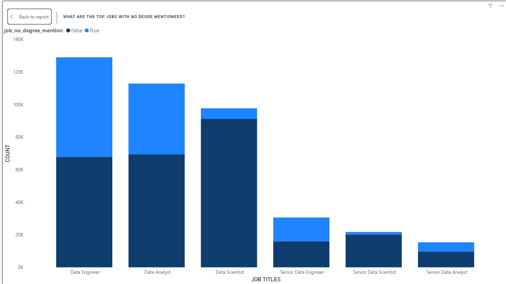
📌**Insight:** Data Engineer and Data Analyst roles have the highest number of job postings that do not mention a degree requirement, suggesting skills-based hiring is more common in these positions.

🎯**Recommendation:** Highlight practical skills and certifications when recruiting for Data Engineer and Data Analyst roles to attract diverse, non-traditional talent pools.

#### **📊 Report: Salary by Country and Job Title**
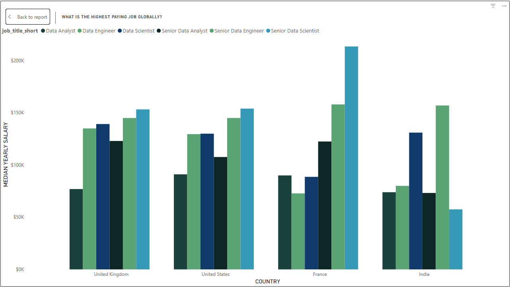
📌**Insight:** Senior Data Scientist roles in France command the highest salary ($175K), while India shows the widest salary variation across roles, with Senior Data Engineers earning significantly more ($165K) than other positions.

🎯**Recommendation:** When hiring internationally, adjust compensation strategies by country — offer competitive premiums for Senior Data Scientists in France and Senior Data Engineers in India to attract top talent.

#### **📊 Report: Degree Requirement by Job Title**
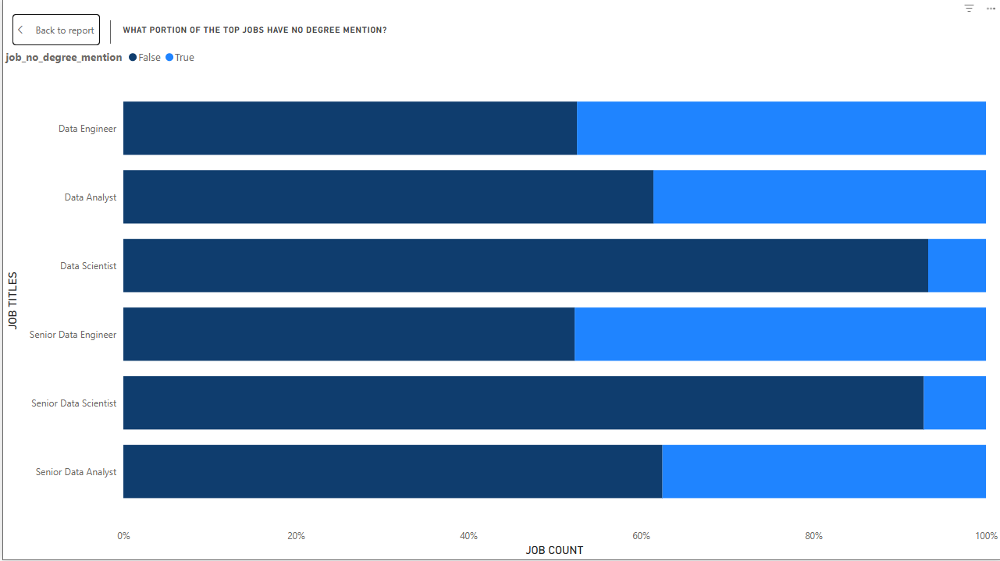
📌**Insight:** Data Engineer and Data Analyst roles have the highest proportion of job postings with no degree mentioned (over 40%), while Senior Data Scientist and Senior Data Analyst positions almost always require a degree.

🎯**Recommendation:**or entry and mid-level technical roles, prioritize skills-based hiring and certifications over formal degree requirements to access a wider talent pool.

#### **📊 Report: Monthly Job Posting Trends**
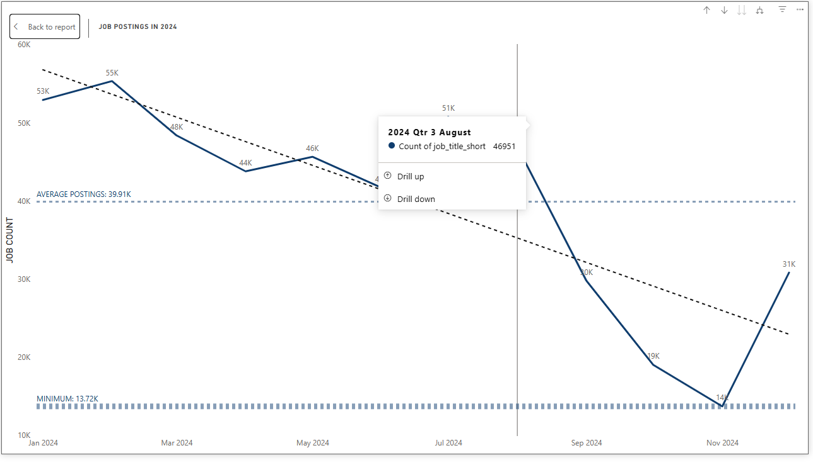
📌**Insight:** Job postings peak in January-February (55K) and decline sharply after August, hitting a low in October (14K), indicating strong seasonal hiring patterns.

🎯**Recommendation:**lan recruitment campaigns for Q1 (Jan-Mar) when job postings are highest; use Q4 for strategic planning and candidate outreach ahead of the hiring surge.

#### **📊 Report: Monthly Job Postings by Role**
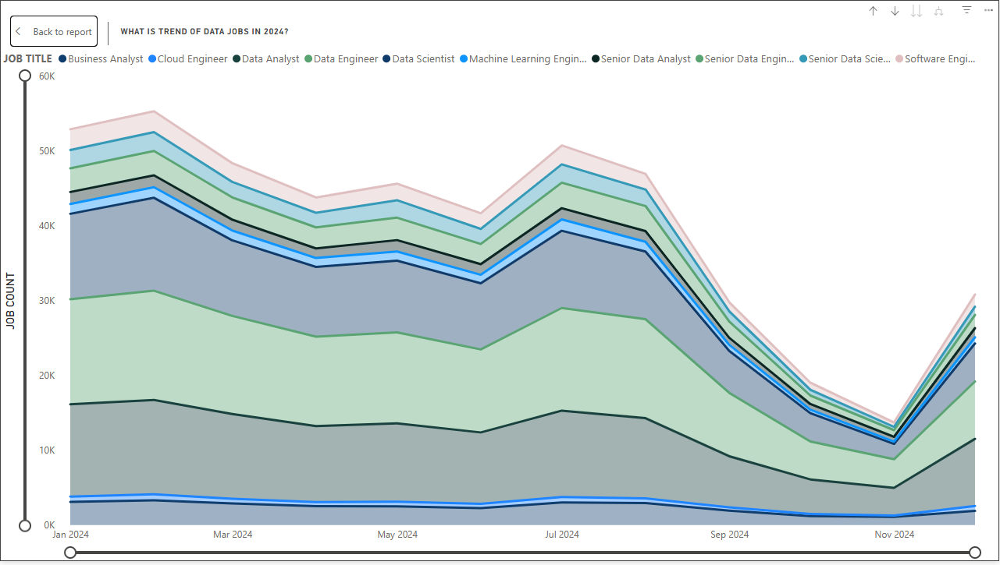
📌**Insight:** Business Analyst roles consistently have the highest monthly job postings (48K peak), while specialized roles like Machine Learning Engineer and Senior Data Engineer show more stable, lower-volume demand throughout the year.

#### **📊 Report: Month-over-Month Job Posting Changes by Role (%)**
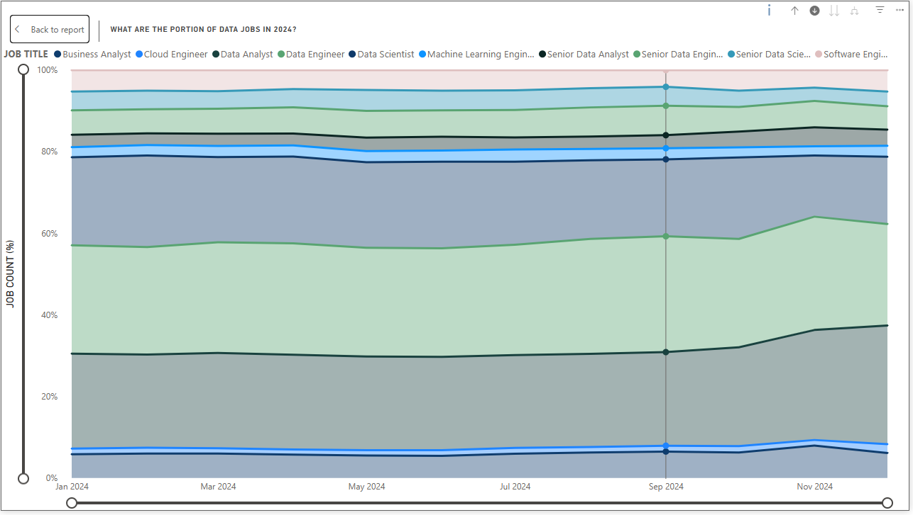
📌**Insight:** Senior Data Engineer and Senior Data Scientist roles show the highest month-over-month growth (up to 50% by November), while entry-level roles like Data Analyst and Data Engineer maintain stable, moderate growth rates.

#### **📊 Report: Median Salary by Job Title**
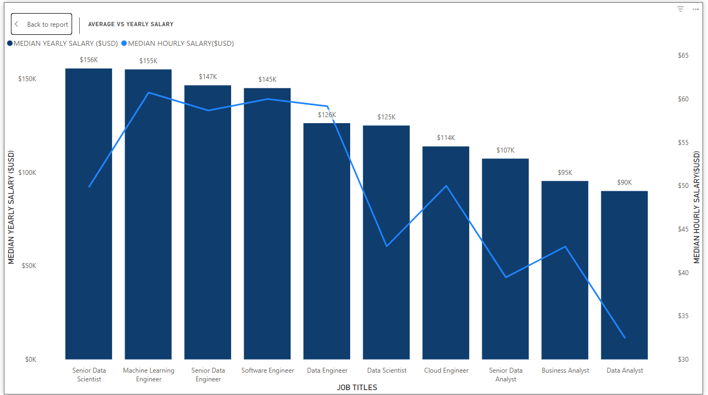
📌 **Insight:** Senior Data Scientist/ML Engineer roles top $155K-$156K median; Data Analysts at $90K (70% gap).

🎯 **Recommendation:** Tier pay clearly—premium for ML/Data Engineering skills over $125K.

#### **📊 Report: Degree Requirement in Job Postings**
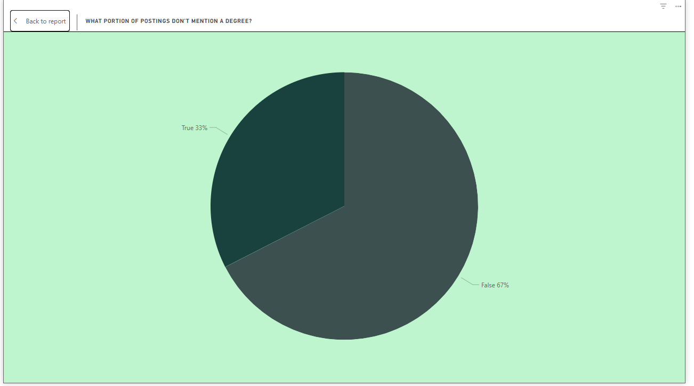
📌**Insight:** Only 33% of job postings skip degree requirements—67% still demand one.

🎯**Recommendation:** Revise JDs to prioritize skills/experience over degrees, especially in technical roles.

#### **📊 Report: Work From Home Job Postings**
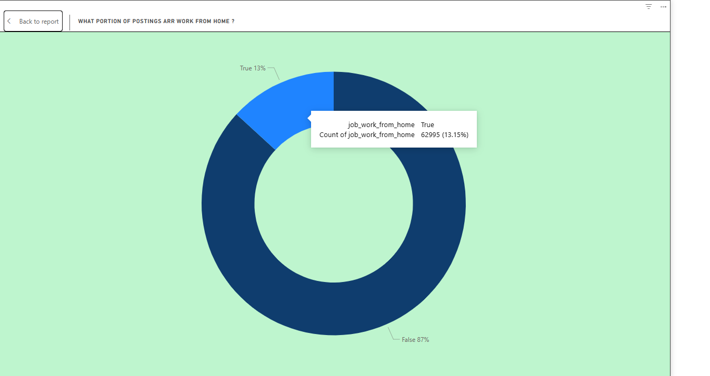
📌**Insight:** Just 13% of jobs offer WFH; 87% demand on-site.

🎯**Recommendation:** Boost remote options to stand out—it's a top talent magnet (only 1 in 8 roles).

#### **📊 Report: Job Types in Data Roles**
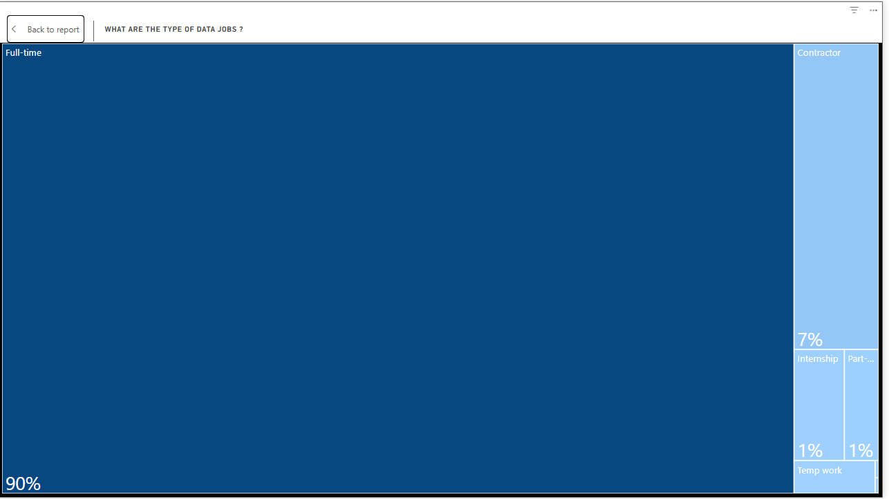
📌**Insight:** Full-time jobs rule at 90%; contractors (7%), internships/part-time/temp (1% each) fill 10%.

🎯**Recommendation:** Prioritize full-time channels; expand contractors/internships for pipelines and flexibility.

#### **📊 Report: Salary vs Hourly Rate by Job Title**

📌**Insight:** ML/Software Engineers top hourly rates ($59-$61/hr); Senior Data Scientists lead annual pay ($160K, $49.5/hr)—varied structures.

🎯**Recommendation:** Weigh annual vs. hourly pay; favor ML/Software Engineers for high-hourly contract/project work.

#### **📊 Report: Job Count by Country (No Degree Mentioned)**
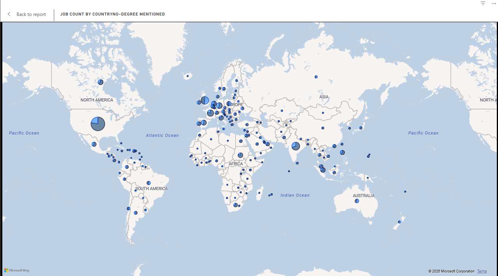
📌**Insight:** North America leads degree-free postings, then Europe/Australia; Africa/South America/Asia lag far behind.

🎯**Recommendation:** Focus skills-based hiring in NA/Europe; offer remote roles to tap talent in undeserved regions.

#### **📊 Report: Median Yearly Salary Globally**

📌**Insight:** North America/Western Europe have the highest pay for data jobs; Russia/Mongolia/Asia/Africa/South America pay much less.

🎯**Recommendation:** Set pay levels by region for global hires; use North America/Europe rates for remote jobs to attract talent.

#### **📊 Report: Compensation Breakdown by Type**
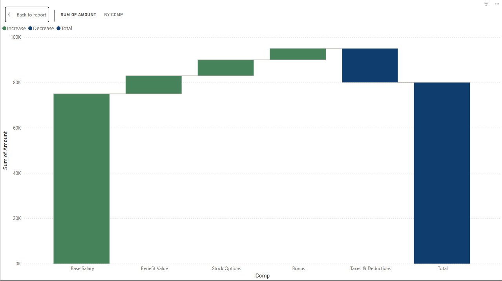
📌**Insight:** Base salary makes up the largest portion of total compensation (~50%), followed by benefits and stock options, while bonuses, taxes, and deductions represent smaller components of the overall package.

🎯**Recommendation:** When structuring competitive offers, highlight the full compensation package including benefits and stock options, not just base salary, to attract top talent — especially for senior roles where equity matters.

#### **📊 Report: Hiring Funnel Analysis**
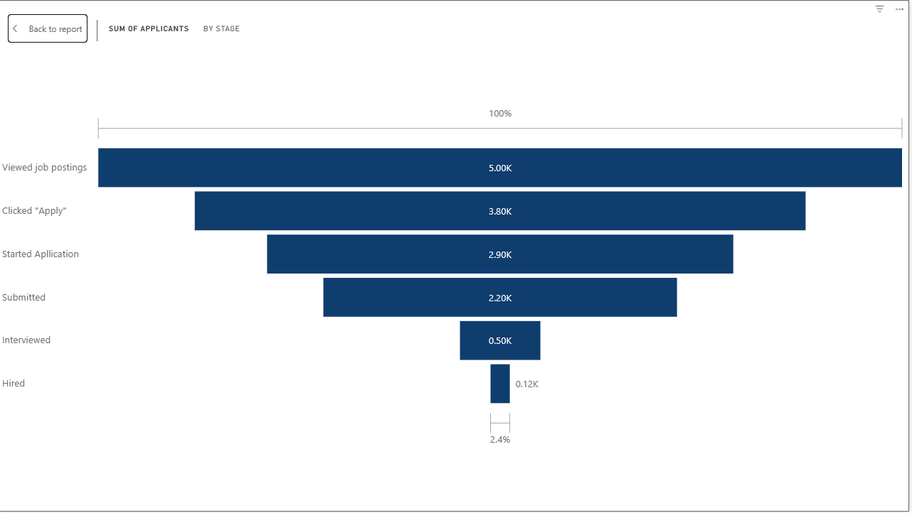
📌**Insight:** Just 2.4% of viewers get hired; biggest drops: 80% from "Submitted" (2.2K) to interviews, and start-to-submit.

🎯**Recommendation:** Simplify apps to cut start-to-submit drop-off; speed up screening/interviews to fix submission-to-interview leak.

#### **📊 Report: Salary Star Rating by Job Posting**
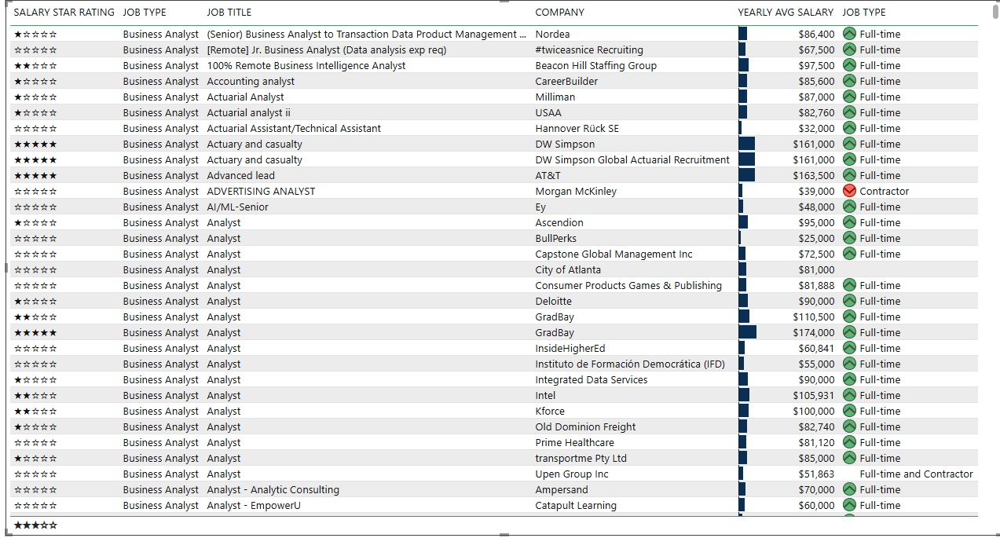
📌**Insight:** All postings get 5-star salary ratings, but pay spans $25K-$163.5K—ratings miss real differences.

🎯**Recommendation:** Fix star rating to show true competitiveness; benchmark with actual salary data for offers.

#### **📊 Report: Job Title Summary with Sparklines**
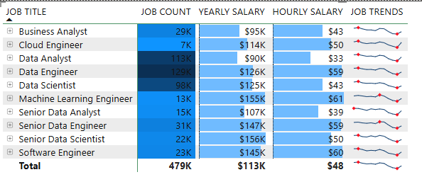
📌**Insight: Top postings:** Data Engineer (129K), Data Analyst (113K); highest pay: ML Engineer/Senior Data Scientist ($155K-$156K, $61/hr).

🎯**Recommendation:** Balance hiring high-volume (Engineer/Analyst) vs. high-pay specialized roles; upskill staff to shift from volume to value.

#### **📊 Report: Median Yearly Salary Gauge**

📌**Insight:** Median data role pay: $113K; tops: Senior Data Scientist ($156K), Senior Data Engineer ($147K), Software Engineer ($145K); Senior Analyst below at $107K.

🎯**Recommendation:** Benchmark mid-level at $113K; add 25-40% premiums for high-demand senior tech roles.

#### **📊 Report: Interactive Dashboard with Slicers**
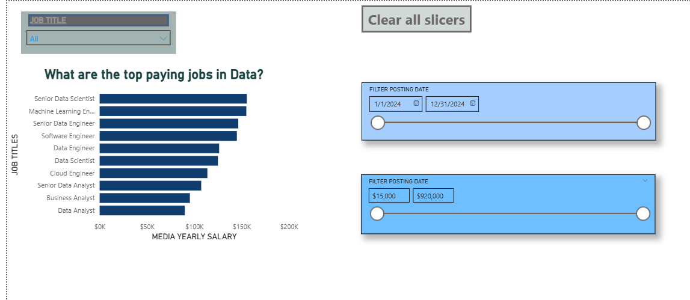
📌**Insight:** The dashboard provides interactive filtering by job title, posting date range, and salary range, allowing users to dynamically explore top-paying roles — with Senior Data Scientist, Machine Learning Engineer, and Senior Data Engineer consistently leading across all filters.

🎯**Recommendation:** Use the slicers to conduct targeted analysis — filter by date to identify seasonal hiring trends, by salary range to focus on premium roles ($150K+), and by job title to benchmark specific positions against market averages.

#### **📊 Report: Data Jobs Dashboard - Main Overview**
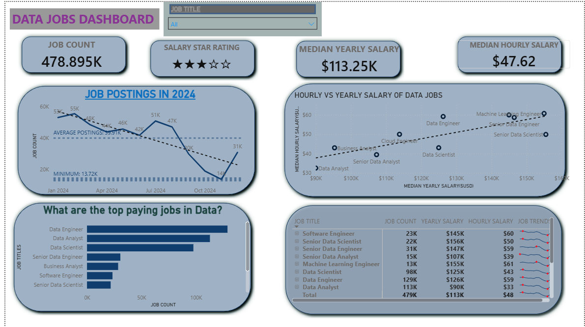
📌**Insight:** 479K postings, $113K median (3 stars); top volume: Data Engineer (129K), Analyst (113K); top pay: Senior Data Scientist ($156K), ML Engineer ($155K). Postings peaked early 2024, then fell.

🎯**Recommendation:** Focus hiring on high-volume Engineer/Analyst roles; budget premiums for ML Engineer/Senior Data Scientist. Plan cycles using 2024 peaks.