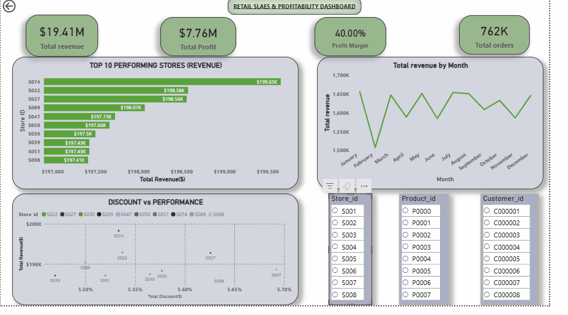

# 📊 Retail Sales & Profitability Dashboard
## 🛠️ Tool: Power BI Desktop
## 📁 Dataset: [Retail Sales Transaction Data (Excel)](https://drive.google.com/file/d/1ad6yrt76PxIkMgu7ONRdXUhO3vfR4Y9z/view?usp=drive_link)
- 78,000+ rows of sales transactions
- Columns: Order_id, Order_date,     Product_id, Store_id, Customer_id, Quantity, Unit_price, Discount, Revenue, Cost

## 🎯 Project Goal
To analyze store performance, revenue trends, and the impact of discounts on profitability across 100+ stores and 200+ products.
## 📸 Dashboard Preview

## 📊 Dashboard Visuals
### KPI Cards
- 💰 Total Revenue: $19.41M
- 📈 Total Profit: $7.76M
- 📉 Profit Margin: 40% — for every $1 revenue, $0.40 is profit
- 📦 Total Orders: 762K

### Charts
1. **Top 10 Performing Stores by Revenue** — Bar chart showing S074 leads with $199.65K
2. **Total Revenue by Month** — Line chart showing monthly trends across the year
3. **Discount vs Performance** — Scatter plot showing relationship between discounts and revenue per store

### Filters/Slicers
- Store_id
- Product_id
- Customer_id

## 💡 Key Insights
- 🏆 **S074 is the top performing store** with $199.65K in revenue
- 📉 **February shows the biggest sales dip** across all months
- 💸 **Profit margin is consistently 40%** across the business
- 🔍 **Higher discounts don't always lead to higher revenue** — visible in scatter plot
- 📦 **762K total orders** processed across all stores

